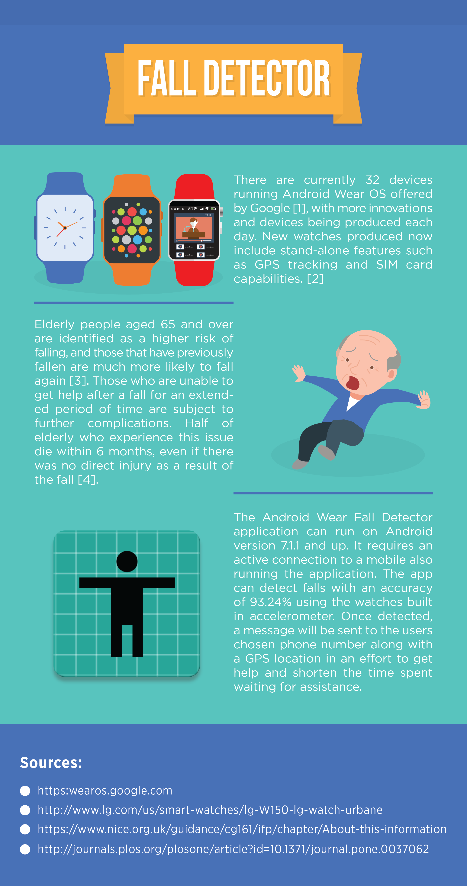

# Fall-Watch-App

This application made as part of my final project and dissertation during my Bachelor's degree. The following is the abstract of this project:

Many automatic fall detection systems have been developed, However, these systems usually include multiple sensors at different locations on the user’s body which are generally disliked by users and not worn. Some projects have tackled this issue by using only sensors on the wrist, these projects tend to have unfavourable accuracies compared to different locations on the body along with limited functionality but with more interest from the target audience.

This project aims to create a wrist-based automatic fall detection system which uses accelerometers from an Android smart watch to detect a fall and an Android mobile connected to the watch to respond to a fall by sending an SMS message along with the location of the fall.

The system is aimed at people over the age of 65 who are at risk of falling and having further difficulties as a result of not getting assistance in time. To ensure that users would be interested in using the device, considerations were taken into design which resulted in a minimalistic and clear interface should the user need to interact with it.

The targets this project set out to achieve were to build a reliable and accurate system and investigate what it would take for elderly people to embrace this technology along with an in-depth analysis and well documented results.

The final results from this project suggest that the overall accuracy of the product in detecting falls is 93.24% with a sensitivity of 86.25% and specificity of 87.5%.

Users who tested this product were positive and would use the device in their day-to-day lives should they need a fall detection system.

